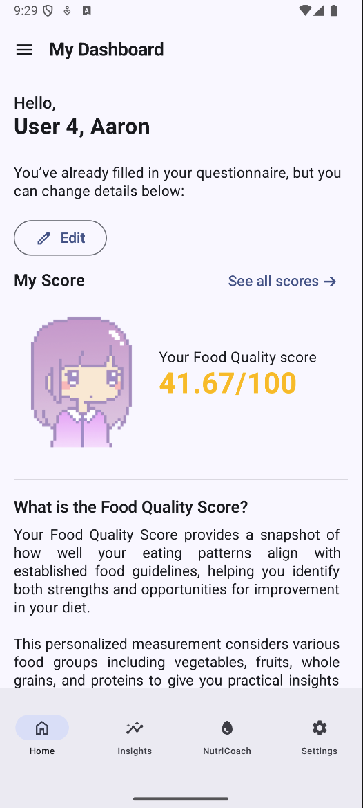
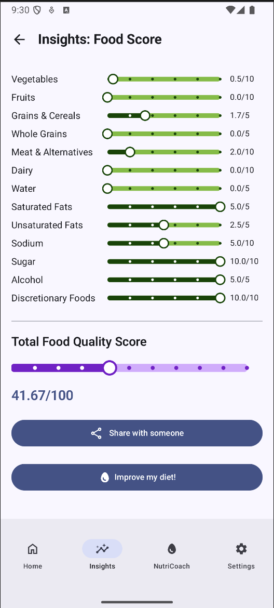
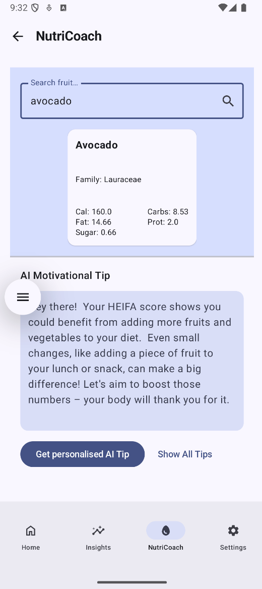
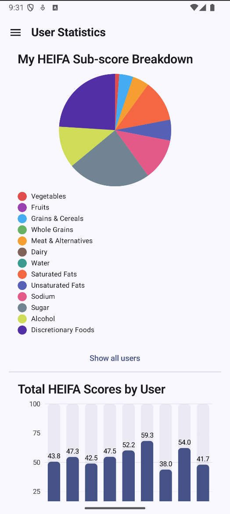

# NutriTrack

NutriTrack is an Android application designed to help users track and improve their dietary habits using the HEIFA scoring system. It provides personalized nutrition tips, tracks user progress, and offers insights for both users and clinicians.

<table border="0">
  <tr>
    <td></td>
         <td></td>
             <td></td>
                 <td></td>
  </tr>
</table>


## Features

- **User Authentication:** Secure login and registration with password hashing.
- **Personalized Dashboard:** Displays user-specific HEIFA scores and dietary stats.
- **NutriCoach:** AI-powered nutrition tips based on user questionnaire responses, leveraging generative AI.
- **Questionnaire:** Collects user dietary habits to tailor recommendations.
- **Fruit & Vegetable Tracking:** Monitors intake and provides encouragement to improve.
- **Insights:** Summarizes user and group dietary patterns, highlighting areas for improvement.
- **Clinician Dashboard:** Aggregates and analyzes data for male and female users, providing insights and patterns.
- **Data Persistence:** Uses Room database for local storage and prepopulates from CSV on first launch.
- **Modern UI:** Built with Jetpack Compose for a responsive and intuitive interface.

## Getting Started

### Prerequisites

- **Android Studio (Meerkat 2024.3.1 Patch 1 or newer)**
- **Android SDK 35**
- **Kotlin 2.0.21**

### Setup

1. **Clone the repository:**
   ```sh
   git clone <your-repo-url>
   cd NutriTrack
   ```
2. **Add your API keys:**
   - Open local.properties (create if missing).
   - Add your Google Generative AI API key:
   - API_KEY=your_actual_api_key_here

3. **Sync Gradle:**

4. **Run the app:**
   - Connect an Android device or start an emulator.
   - Click on the "Run" button in Android Studio,
   - or use the command line:
   ```sh
    ./gradlew clean assembleDebug
    ```

**Notes**

The app uses a local Room database, prepopulated from participantData.csv in the assets folder.
The local.properties file is ignored by Git for security.
The AI features require a valid API key for the generative AI service.

**License**

This project is for educational purposes.
